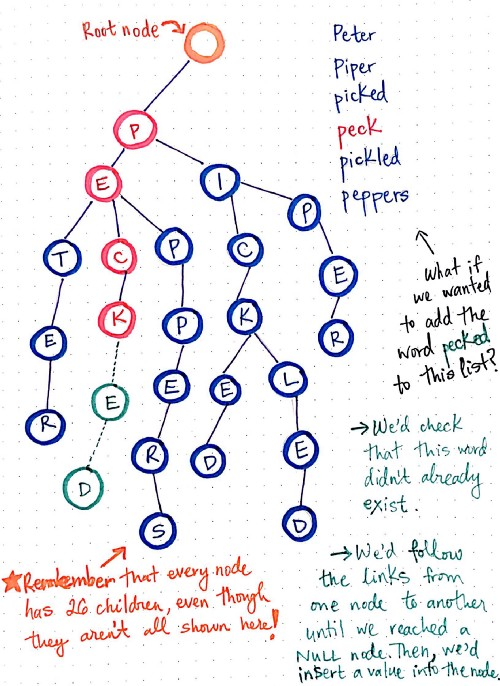

Given two arrays of strings, one containing prefixes (area codes) and one containing numbers (phone numbers), for each number show the longest cooresponding prefix

INPUT:
```
string[] areaCodes = new string[] { "213", "21358", "1234", "12" };
string[] numbers = new string[] { "21349049", "1204539492", "123490485904", "123", "1" };
```

Implementation #1: wrote a quick scanning approach that sorted the prefix array by length and compared substrings for the first hit.

```
Scan Approach Time: 23285 ticks
213    is the longest prefix given 21349049
12     is the longest prefix given 1204539492
1234   is the longest prefix given 123490485904
12     is the longest prefix given 123
       is the longest prefix given 1
```

Implementation #2: Wrote my own implementation something known as a 'TRIE' - a not-well-known type of tree. Each node contains the character value and a boolean representing the end of the prefix string. While it takes longer to build the tree initially, the search is faster. 

```
Trie Creation Time: 47282 ticks
Trie Search Time:   4347 ticks
213    is the longest prefix given 21349049
12     is the longest prefix given 1204539492
1234   is the longest prefix given 123490485904
12     is the longest prefix given 123
       is the longest prefix given 1
```

[LeetCode blog](https://leetcode.com/discuss/interview-question/394697/Twilio-or-OA-2019/355453) did a good job explaining this tree object.

